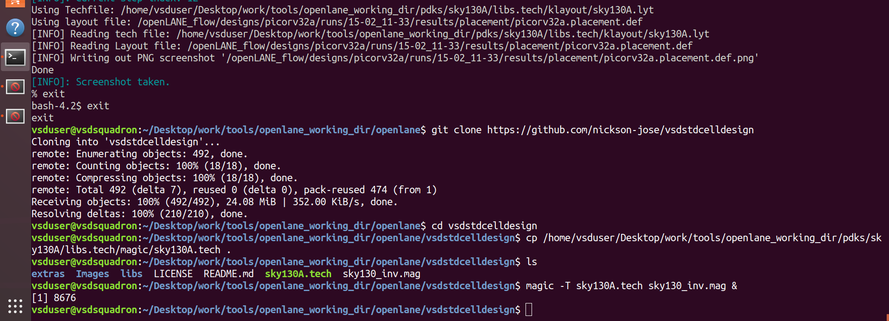
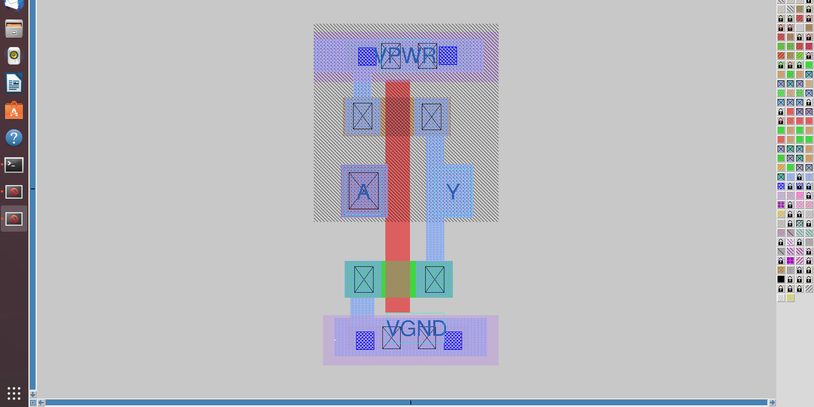
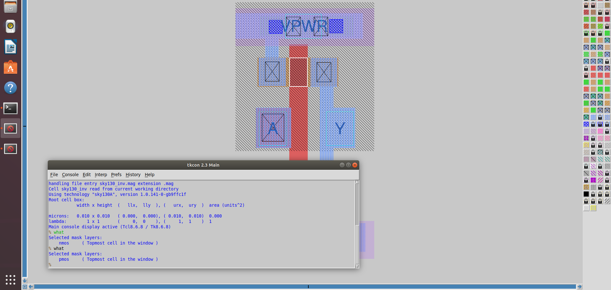
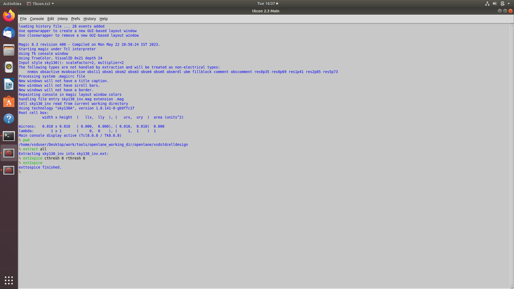
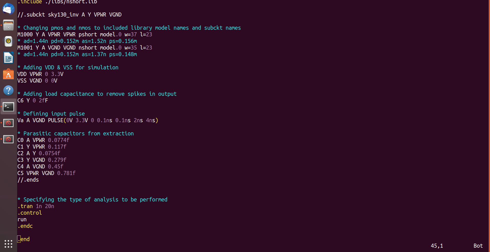
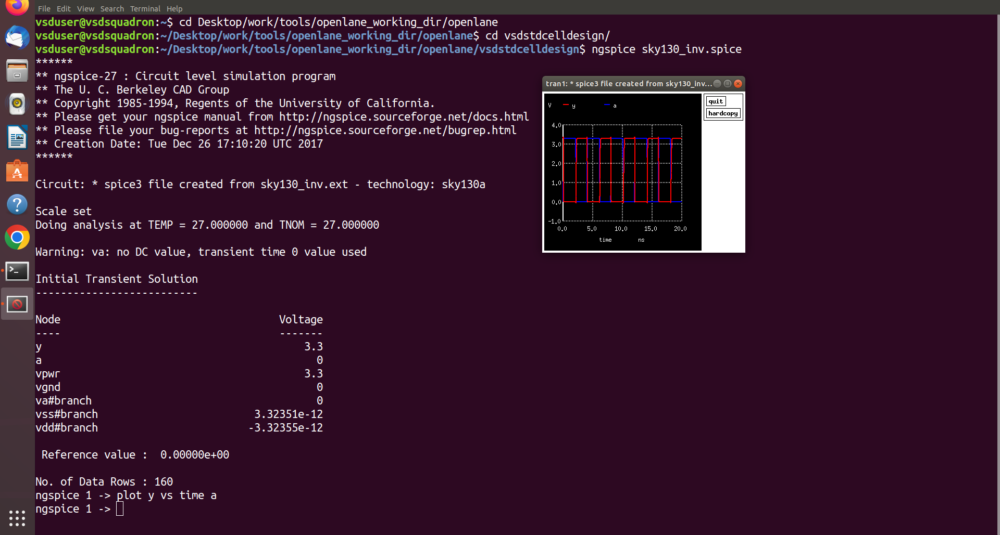
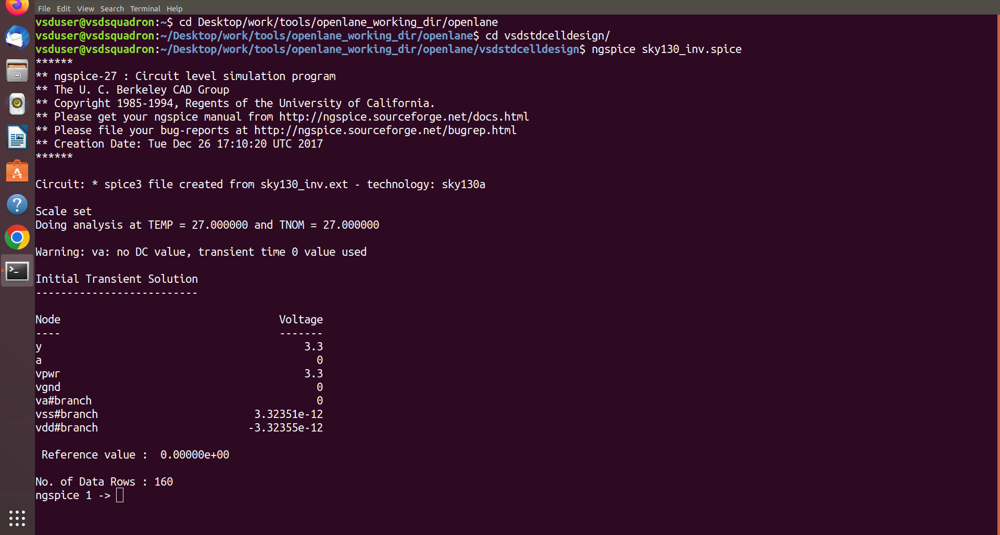
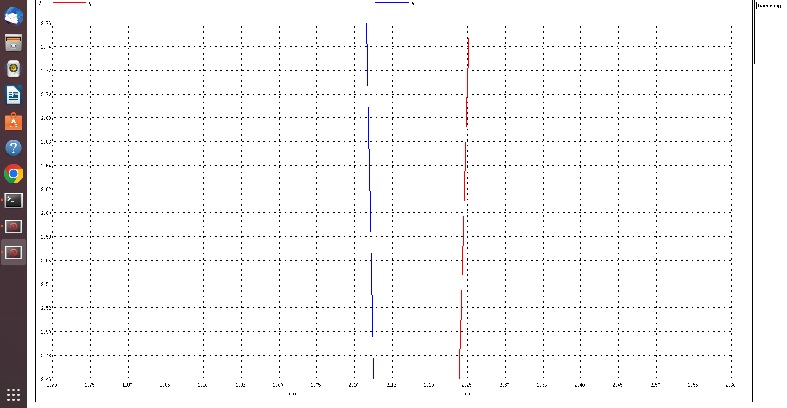
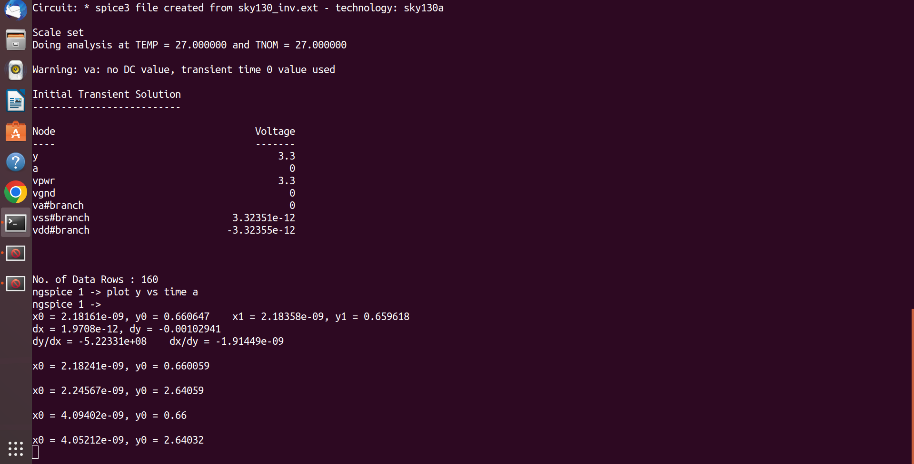

## Day 1: Inception of Open-source EDA, OpenLANE, and Sky130 PDK

### RTL to GDSII Flow
The RTL to GDSII flow is the process of translating a logical Register Transfer Level (RTL) design into a physical layout (GDSII) ready for fabrication. OpenLANE is an automated RTL to GDSII flow built around open-source tools like Yosys, OpenROAD, Magic, and OpenSTA. 

### Invoking OpenLANE
The first step is to invoke the OpenLANE docker container and start the interactive flow.


### Running Synthesis
Logic synthesis translates the RTL code into a gate-level netlist using standard cells from the Sky130 PDK. 

To run synthesis, the following commands are used:
```tcl
prep -design picorv32a
run_synthesis
```

### Flop Ratio Calculation
After synthesis, it is crucial to analyze the design statistics to understand the hardware footprint. From the yosys synthesis reports, we can calculate the flop ratio.


* **Total Number of Cells:** 14876
* **Number of D-Flip-Flops:** 1613
* **Flop Ratio Calculation:** `(Number of D-Flip-Flops / Total Number of Cells)`
* **Flop Ratio:** 1613 / 14876 = **0.1084** (or **10.84%**)

## Day 2: Good Floorplan vs. Bad Floorplan and Introduction to Library Cells

### Floorplanning
The floorplanning phase is critical for the physical design flow. It involves:
* Defining the **Core and Die area**.
* Setting the **Aspect Ratio** and **Utilization Factor**.
* Placing **I/O Pins** along the perimeter.
* Placing **Decoupling Capacitors** (Decap cells) and pre-placed macros.
* Generating the **Power Distribution Network (PDN)** (VDD and VSS power straps).

To run the floorplan in OpenLANE, use the following command:
```tcl
run_floorplan
```
Successful Power Distribution Network (PDN) Generation:


Floorplan Layout in Magic:
Notice the rows defined for standard cells and the I/O pins placed evenly around the edges.

I/O Pin Placement Analysis:
Using the what command in the Magic tkcon console, we can inspect the specific metal layers used for our I/O pins.


Placement
Once the floorplan is set, the tool moves on to Placement. This occurs in two stages:

Global Placement: The tool places standard cells to minimize wire length, ignoring overlaps.


Detailed Placement: The tool legalizes the cells by ensuring they fit exactly into the standard cell rows without any overlaps.


To run placement in OpenLANE:

```tcl
run_placement
```
Global Placement View:

Detailed Placement View (Zoomed In):
Here we can see the individual standard cells strictly aligned to the power and ground rails.


## Day 3: Design and Characterization of One Library Cell

### Part 1: Custom CMOS Inverter Design and SPICE Simulation
Standard cells are the fundamental building blocks of digital physical design. In this section, we characterize a custom CMOS inverter by extracting its parasitic values and simulating it to find its propagation delays and transition times.

**Cloning the Custom Inverter Repository:**
We start by cloning the `vsdstdcelldesign` repository, which contains the Magic layout of a custom CMOS inverter, and opening it using the Magic layout tool.


**Inverter Layout in Magic:**


**Identifying the NMOS and PMOS regions:**
Using the `what` command in the tkcon window, we can identify the specific mask layers used to build the PMOS and NMOS transistors.


**SPICE Extraction from Magic:**
To simulate the behavior of this layout, we must extract its parasitic resistance and capacitance into a SPICE netlist. We do this using the `extract all` and `ext2spice` commands in the tkcon window.


**Modifying the SPICE Deck:**
The extracted SPICE netlist (`sky130_inv.spice`) needs to be modified to include the correct standard cell library models, power supply voltages (VDD = 3.3V, VSS = 0V), input pulse parameters, and the `.tran` command for transient analysis.


**Running ngspice Simulation:**
With the SPICE deck configured, we simulate the circuit using `ngspice` to plot the output voltage (`y`) against the input voltage (`a`) over time.



**Transient Analysis Waveform:**


**Characterizing the Cell Timing:**
To use this custom cell in our OpenLANE flow, we need to characterize its timing parameters from the graph coordinates. We calculate four main values based on the 20% (0.66V), 50% (1.65V), and 80% (2.64V) voltage thresholds:

1. **Rise Time:** Time taken for the output to rise from 20% to 80% of its maximum value.
   * `2.24567ns - 2.18161ns = 0.06406ns` (**64.06ps**)
2. **Fall Time:** Time taken for the output to fall from 80% to 20% of its maximum value.
   * `4.09402ns - 4.05212ns = 0.0419ns` (**41.9ps**)
3. **Cell Rise Delay:** Difference in time between the input falling to 50% and the output rising to 50%.
   * `~0.060ns` (**60ps**)
4. **Cell Fall Delay:** Difference in time between the input rising to 50% and the output falling to 50%.
   * `~0.028ns` (**28ps**)
   

### Part 2: Magic Layout DRC (Design Rule Checks)
Design Rule Checks (DRC) ensure that the physical layout of a chip satisfies the manufacturing constraints set by the foundry (in this case, Skywater 130nm). If a layout fails DRC, the chip will likely fail after fabrication.

**Downloading DRC Test Files:**
We begin by fetching and extracting a set of predefined DRC test layouts from the Open Circuit Design archive to observe how Magic flags rule violations.


**Observing DRC Rules in Magic:**
Opening the test layout in Magic, we can visually inspect various structures. Magic dynamically highlights layout violations with white error paint.


**Analyzing Specific Rule Violations:**
By selecting a region and using the tkcon console (or typing `drc why`), we can pinpoint the exact rule being broken. 
For example, we examined an incorrect poly layout:


We also looked at an N-well violation, where the layout failed due to an incorrect overlap or missing tap rule:


**Modifying the Tech File / Environment:**
To fix certain unresolved DRC rules or update the environment variables, we can use text editors like `gvim` to modify the `sky130A.tech` file or the `.magicrc` startup script.


## Day 4: Pre-layout Timing Analysis and Importance of Good Clock Tree

### Part 1: Extracting LEF and Integrating the Custom Cell
To use our custom `sky130_vsdinv` cell in OpenLANE, we must convert the Magic layout into a standard LEF (Library Exchange Format) file. The LEF hides the internal routing details and only exposes the PR boundary, I/O pins, and power/ground rails to the placement and routing tools.

Before extraction, we ensure the pins align perfectly with the routing grid defined in the `tracks.info` file.


**Extracting the LEF from Magic:**


**Updating Config.tcl:**
We modify our design's `config.tcl` file to include our custom LEF file and point the flow to the extra library elements.


### Part 2: Synthesis and Fixing Timing Violations
With the custom cell integrated, we run synthesis. We can verify that our custom inverter was successfully mapped into the netlist by checking the chip area report.


**The Problem: Negative Slack**
Our initial synthesis run resulted in massive timing violations. The Total Negative Slack (`tns`) and Worst Negative Slack (`wns`) were heavily negative.


**Static Timing Analysis (STA):**
Using OpenSTA outside of the OpenLANE flow, we analyzed the specific failing paths. We found high fanout nets and high delay instances causing the setup time violations.


**Fixing the Slack:**
To fix this, we performed iterative tuning of the synthesis environment variables. We modified parameters like `SYNTH_STRATEGY`, `SYNTH_SIZING`, and `SYNTH_MAX_FANOUT` to force the tool to prioritize delay over area and upsize driving cells.


**Success!**
After aggressively tuning the parameters and replacing weak cells with higher drive-strength equivalents, we successfully achieved a clean timing report with `tns 0.00` and `wns 0.00`.


### Part 3: Floorplan and Placement Verification
With clean timing, we re-ran floorplan and placement. Opening the newly placed DEF file in Magic, we can zoom in and verify that our custom `sky130_vsdinv` cell is legally placed and perfectly overlaps with the power and ground rails.


### Part 4: Clock Tree Synthesis (CTS)
To ensure the clock signal reaches every sequential element (flip-flop) at the same time, we synthesize a Clock Tree using TritonCTS. The goal is to minimize clock skew and latency.

```tcl
run_cts
```


